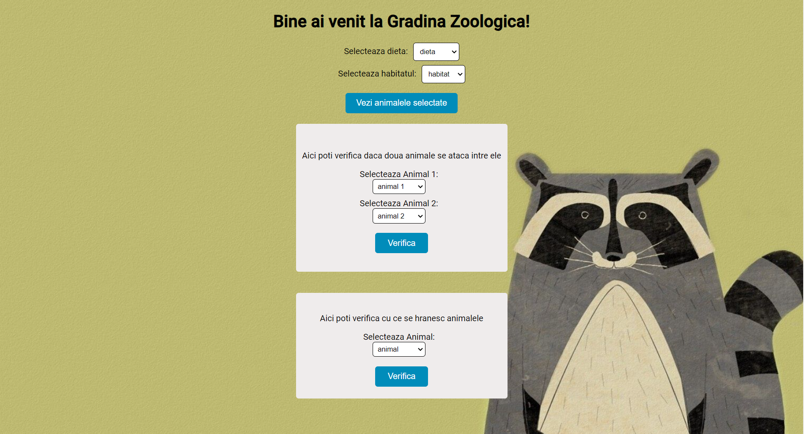

# XML Parser - Zoo

Welcome to the Angular Zoo Garden project! This web application allows users to explore the animals in a zoo and see details about them.

## Introduction

The Angular Zoo Garden is a web application built with Angular that utilizes XML data to showcase information about different animals, their diets, habitats, and more.

## Features

- Select animals based on diet and habitat
- View compatible animals for cohabitation
- Display animal details, including images and food types

## User Interface

Here you can see how the User Interface looks like:

